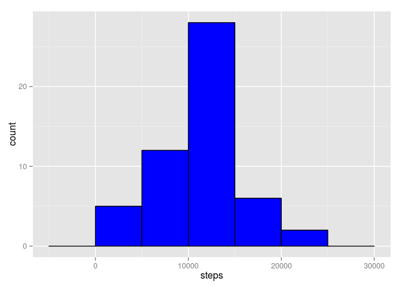
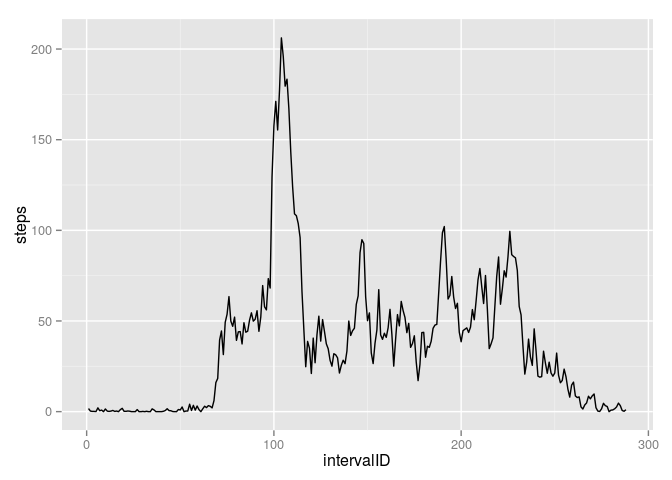
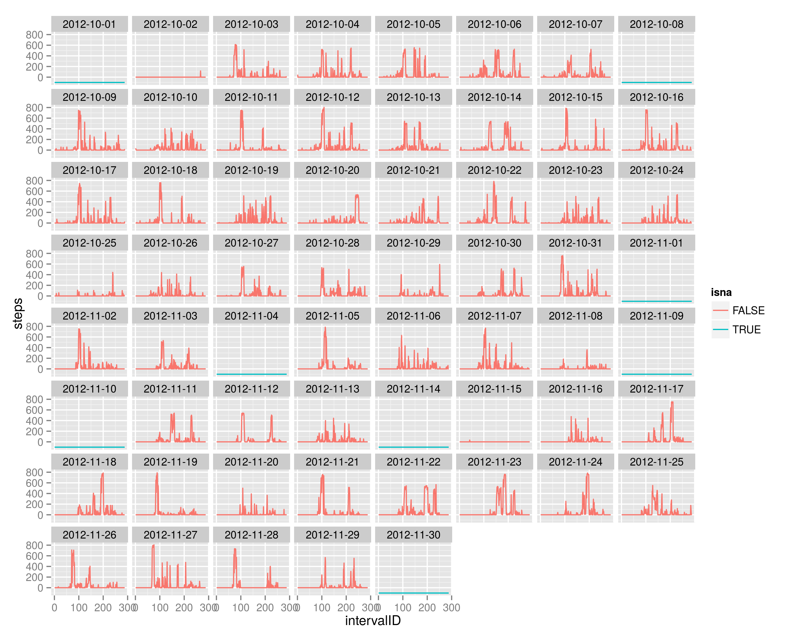
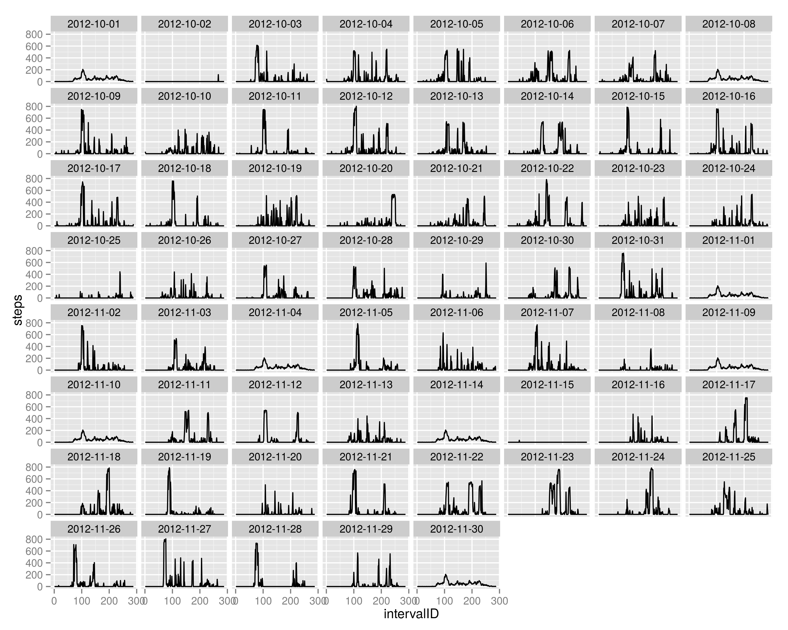
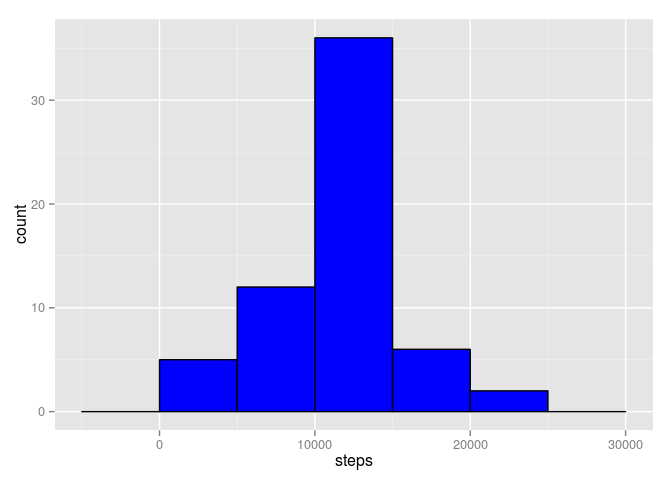
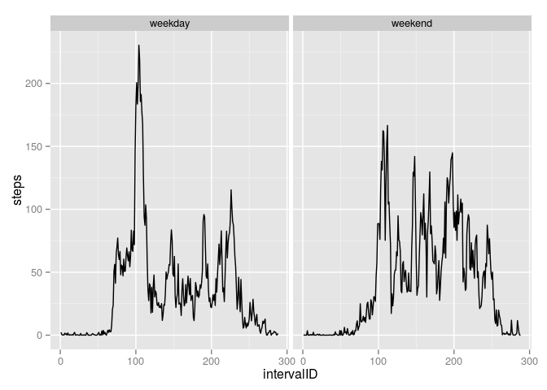

# Reproducible Research: Peer Assessment 1


## Loading and preprocessing the data

#### 1. Load the data
We first unzip and load the "activity.csv" file:


```r
unzip("activity.zip")
activity <- read.csv("activity.csv")
str(activity)
```

```
## 'data.frame':	17568 obs. of  3 variables:
##  $ steps   : int  NA NA NA NA NA NA NA NA NA NA ...
##  $ date    : Factor w/ 61 levels "2012-10-01","2012-10-02",..: 1 1 1 1 1 1 1 1 1 1 ...
##  $ interval: int  0 5 10 15 20 25 30 35 40 45 ...
```

The dataset contain 17568 observations of 3 variables:

* **steps**: Number of steps taking in a 5-minute interval (missing
    values are coded as `NA`)

* **date**: The date on which the measurement was taken in YYYY-MM-DD
    format

* **interval**: Identifier for the 5-minute interval in which
    measurement was taken

#### 2. Process/transform the data into a format suitable for analysis

We then format the `date` variable from character to a object of class `Date` and we create the variable `intervalID`  which converts the variable `interval` into indices of the corresponding 5 minutes interval (_eg._ 0 becomes 1, 5 becomes becomes 2, ..., 55 becomes 12, 100 becomes 13 ...).
This makes the indexing more consistent as the difference between between 2 consecutive `interval` values should be constant (5 minutes) and it is not the case with _eg._ 55 and 100, or 155 and 200, and so on ... This is useful when plotting the number of steps against the correponding interval.


```r
activity$date <- as.Date( activity$date, "%Y-%m-%d")
activity$intervalID <- sapply( activity$interval, function(x){ 
  t <- sprintf("%04d", x)
  ( as.numeric(substr(t, 1, 2))*60 + as.numeric(substr(t, 3, 4)) )/5 + 1
})
```
## What is mean total number of steps taken per day?

#### 1. Make a histogram of the total number of steps taken each day
We first calculate the total number of steps taken per day for each day; note that we keep the default option for the `sum` function `na.rm=FALSE` so that each day with at least one missing value is excluded from the calculation of the sums of daily steps by being coded also as missing.


```r
library(plyr)
data <- ddply( activity[,c("steps", "date")], "date", summarize, steps=sum(steps) )
```

We then plot the histogram:

```r
library(ggplot2)
ggplot( data, aes(x=steps) ) + geom_histogram( binwidth=5000, colour='black', fill='blue' )
```

 

#### 2. Calculate and report the **mean** and **median** total number of steps taken per day

```r
mean(data$steps, na.rm=T)
```

```
## [1] 10766.19
```

```r
median(data$steps, na.rm=T)
```

```
## [1] 10765
```


## What is the average daily activity pattern?

#### 1. Make a time series plot (i.e. type = "l") of the 5-minute interval (x-axis) and the average number of steps taken, averaged across all days (y-axis)


```r
ggplot(activity, aes(intervalID, steps)) + stat_summary(fun.y = mean, geom="line", na.rm=T)
```

 

#### 2. Which 5-minute interval, on average across all the days in the dataset, contains the maximum number of steps?

Create a date frame which contains for each 5-minute interval the average number of steps across all days:

```r
dataMeanInt <- ddply( activity[,c("steps", "interval")]
                  , "interval", summarize
                  , steps=mean(steps, na.rm=T)
                  )
```

Find the maximum value:

```r
max(dataMeanInt$steps)
```

```
## [1] 206.1698
```

Return the corresponding interval:

```r
dataMeanInt$interval[which.max(dataMeanInt$steps)]
```

```
## [1] 835
```

## Imputing missing values

#### 1. Calculate and report the total number of missing values in the dataset (i.e. the total number of rows with `NA`s)

Number of missing values:

```r
sum(is.na(activity$steps))
```

```
## [1] 2304
```

Observe where are the missing values:

```r
naReplacementValue <- -100
temp <- activity[, c("intervalID", "steps", "date")]
temp$isna <- F
temp$isna[is.na(temp$steps)] <- T
temp$steps[is.na(activity$steps)] <- naReplacementValue
ggplot(temp, aes(intervalID, steps)) + geom_line(aes(colour=isna)) + facet_wrap(~date)
```

 

The missing values are coded in blue at -100; we see that we have missing values for 5 complete days and for the other days there is no missing value.
Thus when there is data for one day, all data for that day is present.

#### 2. Devise a strategy for filling in all of the missing values in the dataset
Based on previous observation concerning missing values, we choose for each missing value, to replace it with the average nb of steps accross all day for the corresponding 5-minutes interval:

#### 3. Create a new dataset that is equal to the original dataset but with the missing data filled in

```r
activity2 <- activity
indsNA <- which(is.na(activity2$steps))
for(i in indsNA){
  activity2$steps[i] <- dataMeanInt$steps[ dataMeanInt$interval == activity2$interval[i] ]
}
```

Show the evolution number of steps for each day on the new dataset:

```r
ggplot(activity2, aes(intervalID, steps)) + geom_line() + facet_wrap(~date)
```

 

We see that for each days where we previously had missing values, we now have the average number of steps.

#### 4. Make a histogram of the total number of steps taken each day and Calculate and report the **mean** and **median** total number of steps taken per day

Histogram of the total number of steps taken each day:

```r
data2 <- ddply( activity2[,c("steps", "date")], "date", summarize, steps=sum(steps) )
ggplot( data2, aes(x=steps) ) + geom_histogram( binwidth=5000, colour='black', fill='blue' )
```

 

Mean number of steps taken each day:

```r
mean(data2$steps, na.rm=T)
```

```
## [1] 10766.19
```

Median number of steps taken each day:

```r
median(data2$steps, na.rm=T)
```

```
## [1] 10766.19
```

As we could expect (since we replace missing values by their mean), the mean value is unchanged, we however observe a slight increase in the median value which is now equal to the mean.

## Are there differences in activity patterns between weekdays and weekends?

#### 1. Create a new factor variable in the dataset with two levels -- "weekday" and "weekend" indicating whether a given date is a weekday or weekend day.

```r
activity2$dayType <- "weekday"
activity2$dayType[ weekdays(activity2$date) %in% c("Saturday", "Sunday") ] <- "weekend"
```

#### 2. Make a panel plot containing a time series plot (i.e. `type = "l"`) of the 5-minute interval (x-axis) and the average number of steps taken, averaged across all weekday days or weekend days (y-axis).

```r
ggplot(activity2, aes(intervalID, steps)) + 
  stat_summary(fun.y = mean, geom="line", na.rm=T) + 
  facet_wrap( ~dayType )
```

 
